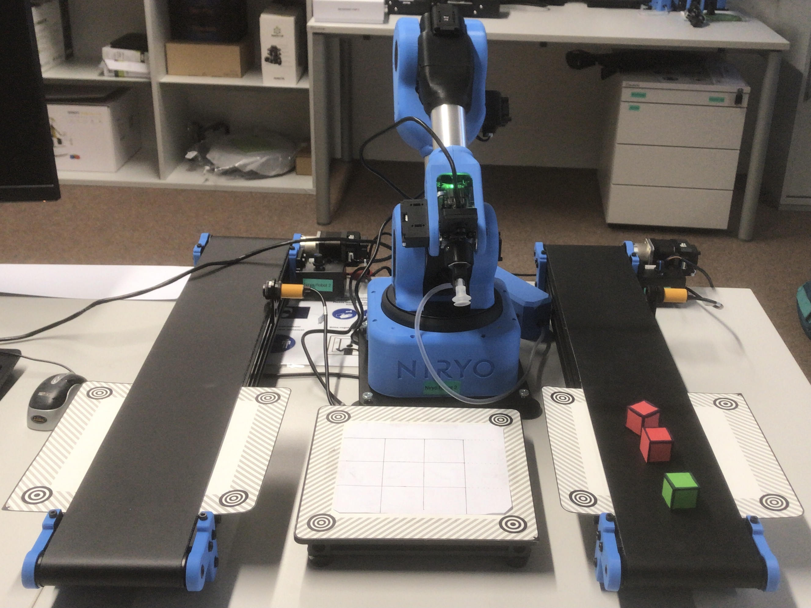

This use-case was developed with ROS1 melodic on the Niryo Ned 1 robot. The aim of this use-case is for Niryo to pick up items from the left and/or right conveyor belt(s) and place the item on top of the box in the center. 

Some choices are given to the user such as:

The picture below shows the setup of the robot with the conveyor belts right and left:

The steps to follow for the setup of the Ned robot are:
1. Mount the IR Sensor on the conveyor belt.
2. Plug the communication wires behind the niryo robot Ned. 
3. Let the conveyor belts move by switching the power supply on. 
4. Make sure to label everything correctly since there are two conveyor belts it is important to label the conveyor belt correctly.
5. For the visual sets, it is important to get the correct coordinates of the robot arm's positions and the joints. For this the correct positions can be taken from the NiryoStudio exe file. 
6. In the code niryo_conveyors.py provided at the github repository, the three positions are stated as: box_position, obs_conv_left and obs_conveyor_right. 
