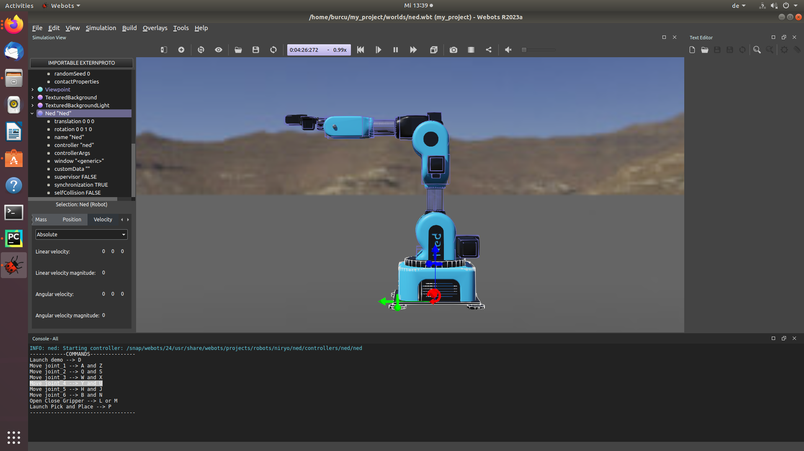

With webots it is both possible to control and simulate the robot. There are example worlds built upon webots in which there are many robots to choose from. There you can also find the niryo ned robot with the demonstration of pick and place.

You can place the robot in any environment you wish. Below you can see the Niryo Ned 1 being placed in the desert. 

Just to give a brief summary. A world is a file containing information like where the objects are, what they look like, how they interact with each other. The world defines the initial state of the simulation.

The different objects are called nodes and have the extension .wbt. Please see the file ned_conveyor_movements.wbt to see the simulation. When opening the gui program, make sure that the world file is stored directly in the world program. The world also contains the global parameters

Here it is also important to understand what PROTO is:
 - Proto Definition, here you can find the example niryo ned 1 robot
 - 
