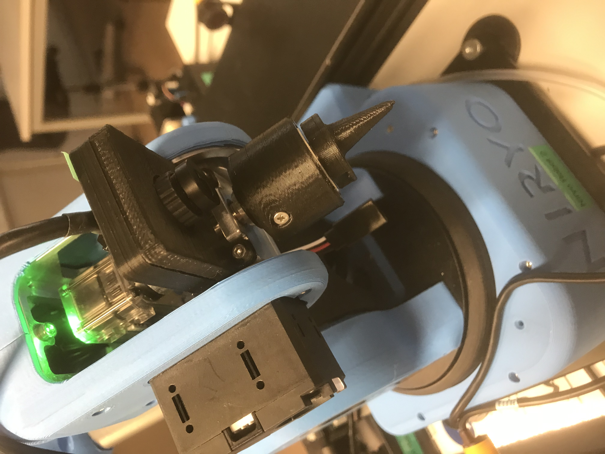
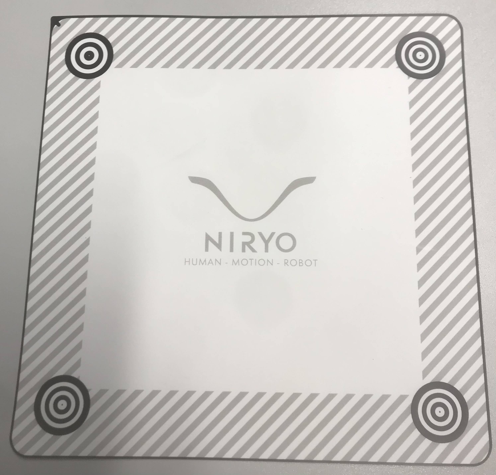
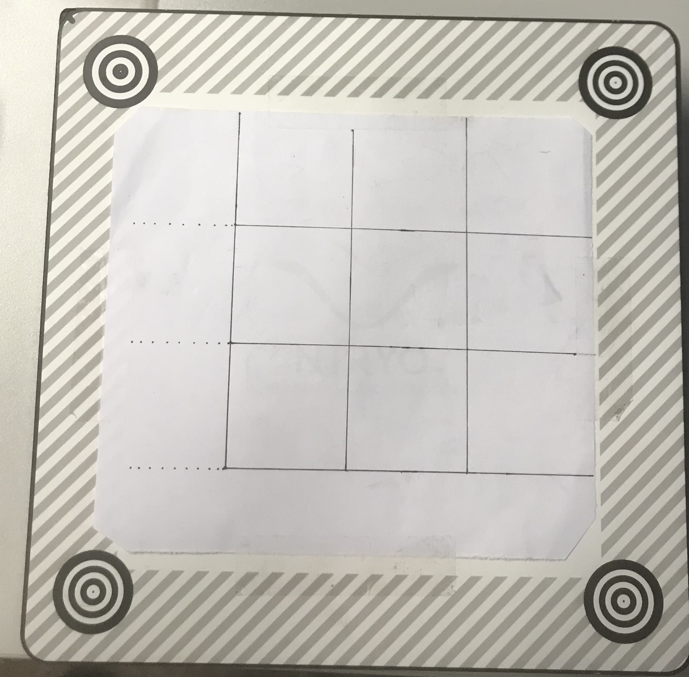

# Application exemples: Vision tic tac toe

Documentation from the official niryo website is available [here](https://niryo.com/docs/niryo-one/niryo-one-industrial-demonstrators/vision-tic-tac-toe/).

There were several modifications done on the Tic-Tac-Toe software of Ned:

1. The exemplary python code for the Tic-Tac-Toe game was modified such that the tokens were taken from the sides of the playing field and not from a stack. This you can see on the figure below at step 4.
2. The tokens used did not belong to the accessories provided by the Niryo company but rather were our own. Since they were easier to pick up with the vacuum pump. Furthermore, the tokens were of the color red and green.
3. Regarding the brightness conditions, it is important to play the game on a field where there is no shadow or reflection of the robot visible on the field.

For getting started with playing the Tic-Tac-Toe, make sure to know the ip address of the niryo robot, this you can find via the general description of setting up the niryo robots at the beginning of the Niryo folder.

Afterwards pull the code from this folder and run the "tictactoe_vision.py" code on any python editor you wish. What is important is that the pyniryo package is installed via: pip install pyniryo

Things to change in the code itself: 
- the ip address (tictactoe_vision.py  line 14)
  - Data which needs to be changed in the tic_tac_toe_config.yaml file:
     - workspace of the niryo robot (this is done via calibration of the visual set)
     - observation pose (this position should contain all landmarks inside of the vision)

In order to change the workspace make sure to mount the tip on to the robot as shown on figure:

     
4. Then, for the vision set make sure to use the calibration tip correctly for the four landmarks. Start by calibrating the workspace with the Niryo One Studio. Also make sure that the oberservation pose which is in the configuration yaml file, has all the four landmarks visible on the camera view.

5. After all the configurations are done, make sure to have the game field of the tic tac toe in a 3x3 field drawn as shown below.

6. Then you can start the game, by running the code tictactoe_vision.py. If you start it without the menu then the default settings will be taken. 

Furthermore, please see this youtube link on our CDL-MINT channel. It is a demonstration that was presented at the Haus der Industrie in Vienna : Youtube Link: [[https://www.youtube.com/channel/UC4Gn8bjBU00AME4R17MIqgA](https://www.youtube.com/watch?v=NVb2YjT2sRI)](youtube channel)

