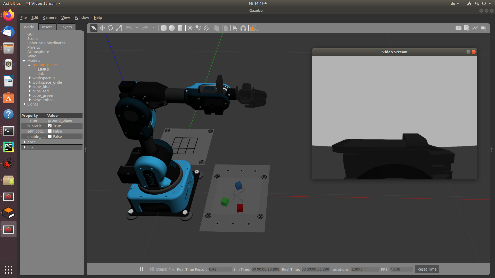

Gazebo is only a simulation tool for visualizing the motion planning but there is no motion planning involved in the actual robot. It communicates via ros with the siumlation tool moveit and gets the data from there.

With this command, a simulation without a world can be downloaded:

roslaunch niryo_robot_gazebo niryo_gazebo_world.launch world_name:=niryo_cube_world

The figure below shows a virtualization of niryo on gazebo. There is also a camera perspective involved which you can see as a pop-up screen on the right.

