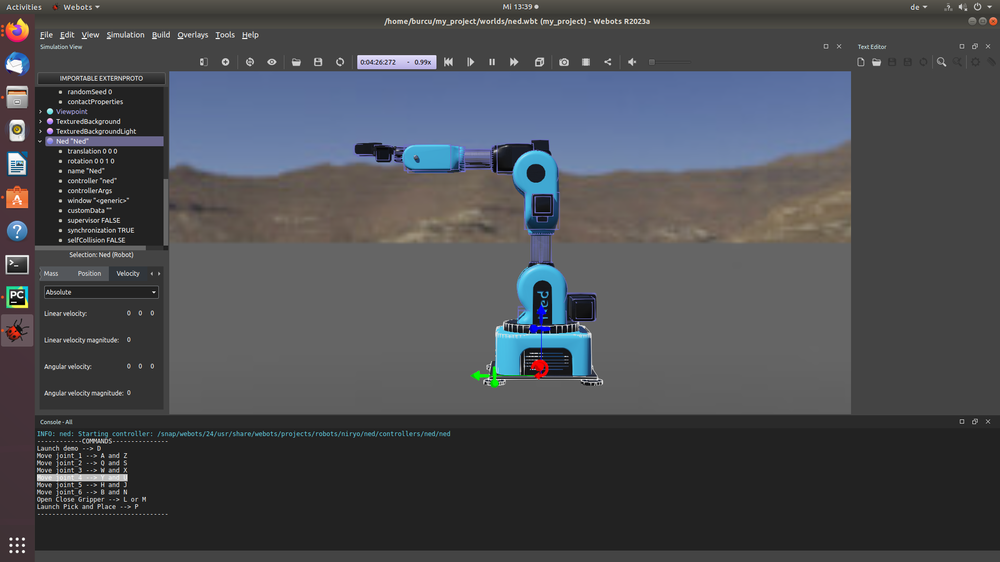

With webots it is both possible to control and simulate the robot. There are example worlds built upon webots in which there are many robots to choose from. There you can also find the niryo ned robot with the demonstration of pick and place.

You can place the robot in any environment you wish. Below you can see the Niryo Ned 1 being placed in the desert. 

