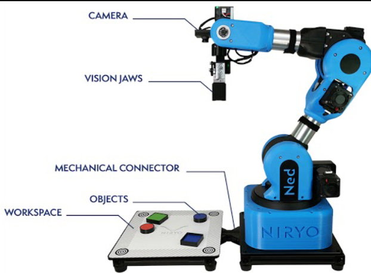
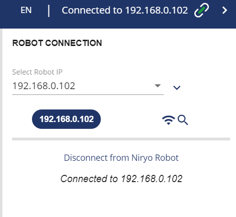
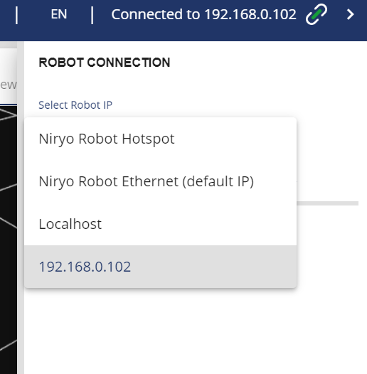
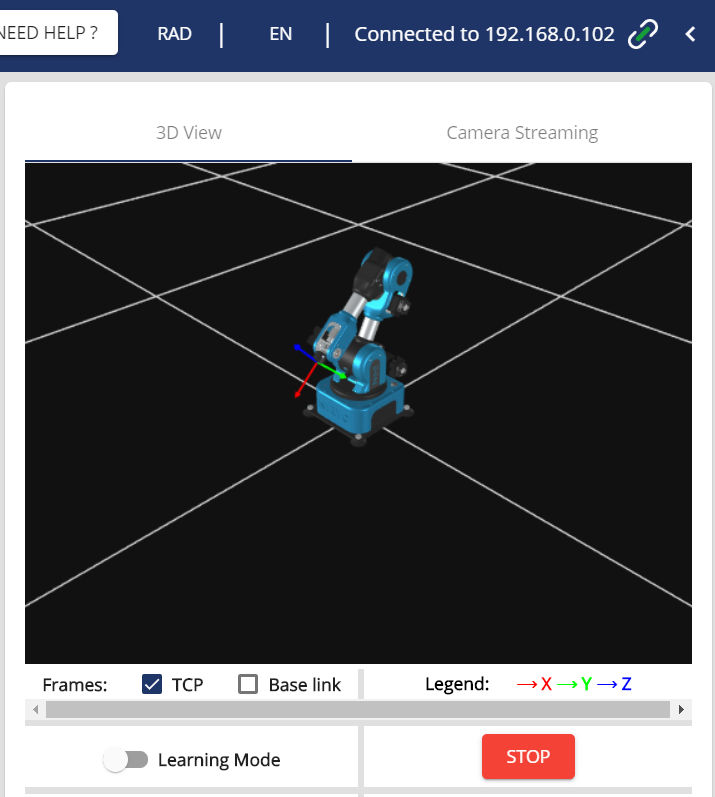
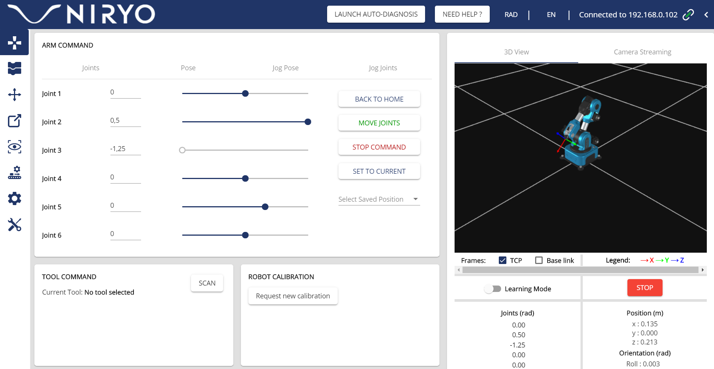

# Niryo
 
### The folders are divided into the several functionalities of Ned and Use Cases we have tried out for the Niryo Robot

1. [Ned API examples] (./Ned API examples):
   - Vision conditioning conveyor belt
2. [Ned_ROS](./Ned_ROS):
   - Simulations:
        - Webots
        - Moveit
        - Gazebo
   - Use Cases
   
   
 ## General Points to Consider when setting up the Ned Robot:
 
 The robot Ned is a 6 axis-collaborative robot. Since we used the ros melodic version for setting up the niryo robot the respective ubuntu version, needed to be installed on the remote pc. This was of the ubuntu version 18.04.
 
 The Ned 1 package comes with a ready assembled robot. Depending on the application, there might be specific setups needed. However these will be described carefully in each application at the readme file. 
 
 As you can see on the figure below, the setup of Ned with the vision kit comes already in a ready to use way:
 
  
 
 Therefore the software steps needed for ned 1 will be listed here:
 
 1. First it is highly adviced to install the niryo studio related to the operating system of the computer and the version of the niryo robot on this website: https://niryo.com/download/ 
 
 Once installed you can find the ip address of the robot by clicking on the magnifier as shown on the figure below.
 
 
 
 After clicking on the magnifier you can see the options from the dropdown menu and also the ip address of the robot which you want to connect to. What is important to consider regarding the connection to the ip address is that the wifi settings are set up according to the right network. The other options on connecting to the niryo robot are via the robot's local hotspot or an ethernet connection. On this website you can find a more detailed description: https://docs.niryo.com/product/niryo-studio/v4.0.0/en/source/connection.html
 
 
 
 2. Once you are connected to the niryo robot, there should be a 3D CAD physical model that should be visible on the studio. If there is a camera plugged into the robot via usb, then this should also appear under "Camera Streaming". This you can see next to the "3D View" tab.
 
 
 3. Afterwards, if you would like to work on the niryo studio itself, you can see the figure below on which there are many options to program the robot via a GUI interface. 
  
