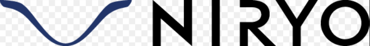
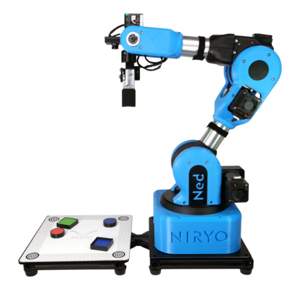

<!--
*** Thanks for checking out the Best-README-Template. If you have a suggestion
*** that would make this better, please fork the repo and create a pull request
*** or simply open an issue with the tag "enhancement".
*** Don't forget to give the project a star!
*** Thanks again! Now go create something AMAZING! :D
-->

<!-- PROJECT SHIELDS -->
<!--
*** I'm using markdown "reference style" links for readability.
*** Reference links are enclosed in brackets [ ] instead of parentheses ( ).
*** See the bottom of this document for the declaration of the reference variables
*** for contributors-url, forks-url, etc. This is an optional, concise syntax you may use.
*** https://www.markdownguide.org/basic-syntax/#reference-style-links
-->

<!-- PROJECT LOGO -->
 

  

<h3 align="center">Niryo Ned Robot Projects</h3>

  

    Niryo Robots
     
    <a href="https://github.com/github_username/repo_name"><strong>Explore the docs »</strong></a>
     
     
    <a href="https://github.com/github_username/repo_name">View Demo</a>
    ·
    <a href="https://github.com/github_username/repo_name/issues">Report Bug</a>
    ·
    <a href="https://github.com/github_username/repo_name/issues">Request Feature</a>
  

<!-- TABLE OF CONTENTS -->

  
Table of Contents

  <ol>
    <li>
      <a href="#about-the-project">About The Project</a>
      <ul>
        <li><a href="#built-with">Built With</a></li>
      </ul>
    </li>
    <li>
      <a href="#getting-started">Getting Started</a>
      <ul>
        <li><a href="#prerequisites">Prerequisites</a></li>
        <li><a href="#installation">Installation</a></li>
      </ul>
    </li>
    <li><a href="#usage">Usage</a></li>
    <li><a href="#roadmap">Roadmap</a></li>
    <li><a href="#contributing">Contributing</a></li>
    <li><a href="#license">License</a></li>
    <li><a href="#contact">Contact</a></li>
    <li><a href="#acknowledgments">Acknowledgments</a></li>
  </ol>

<!-- ABOUT THE PROJECT -->
## About The Project
 
We have used the Ned robot for our CDL MINT projects for several cases. On our repository you may find these projects in seperate folders. 

(<a href="#top">back to top</a>)

### Built With

* python, ROS melodic

(<a href="#top">back to top</a>)

<!-- GETTING STARTED -->
## Getting Started

Here, you will find the general steps necessary for starting any ROS or python API project with Ned and then you will find the several st
### Prerequisites

Having the necessary hardware available for the project.

### Installation

1. First install the Ubuntu 18.04 on the remote PC
2. Then install the ROS melodic on to the Niryo Ned Robot
3. When the installation of the packages are done, then the python API can be started. 
4. For the installation steps, please see the website: < href="https://docs.niryo.com/product/ned/v3.1.1/en/source/software/niryo_studio.html">

<!-- USAGE EXAMPLES -->
## Usage
The Ned robot can be used for industrial and/or educational purposes. The folders have the different use cases for the Niryo robots. Our use case for the educational purpose is the Tic-Tac-Toe game. 

Our industrial use case is the Niryo Ned robot with the ROS programming and the conveyor belts.

(<a href="#top">back to top</a>)

<!-- CONTACT -->
## Contact
Burcu Taspinar - 

Youtube Link: [https://www.youtube.com/channel/UC4Gn8bjBU00AME4R17MIqgA](youtube channel)

(<a href="#top">back to top</a>)

<!-- MARKDOWN LINKS & IMAGES -->
<!-- https://www.markdownguide.org/basic-syntax/#reference-style-links -->
[contributors-shield]: https://img.shields.io/github/contributors/github_username/repo_name.svg?style=for-the-badge
[contributors-url]: https://github.com/github_username/repo_name/graphs/contributors
[forks-shield]: https://img.shields.io/github/forks/github_username/repo_name.svg?style=for-the-badge
[forks-url]: https://github.com/github_username/repo_name/network/members
[stars-shield]: https://img.shields.io/github/stars/github_username/repo_name.svg?style=for-the-badge
[stars-url]: https://github.com/github_username/repo_name/stargazers
[issues-shield]: https://img.shields.io/github/issues/github_username/repo_name.svg?style=for-the-badge
[issues-url]: https://github.com/github_username/repo_name/issues
[license-shield]: https://img.shields.io/github/license/github_username/repo_name.svg?style=for-the-badge
[license-url]: https://github.com/github_username/repo_name/blob/master/LICENSE.txt
[linkedin-shield]: https://img.shields.io/badge/-LinkedIn-black.svg?style=for-the-badge&logo=linkedin&colorB=555
[linkedin-url]: https://linkedin.com/in/linkedin_username
[product-screenshot]: images/screenshot.png
